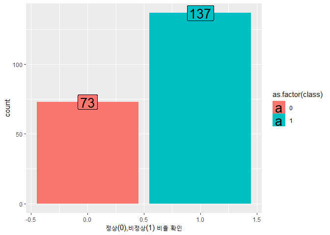
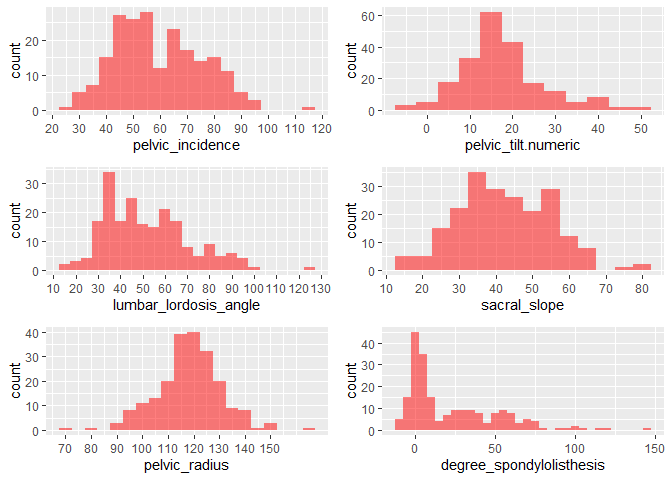
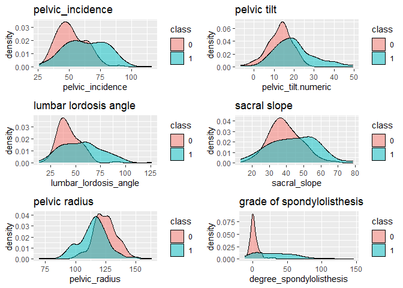
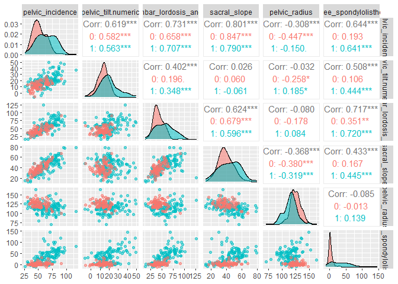
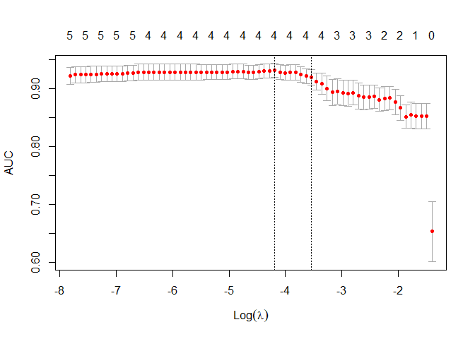
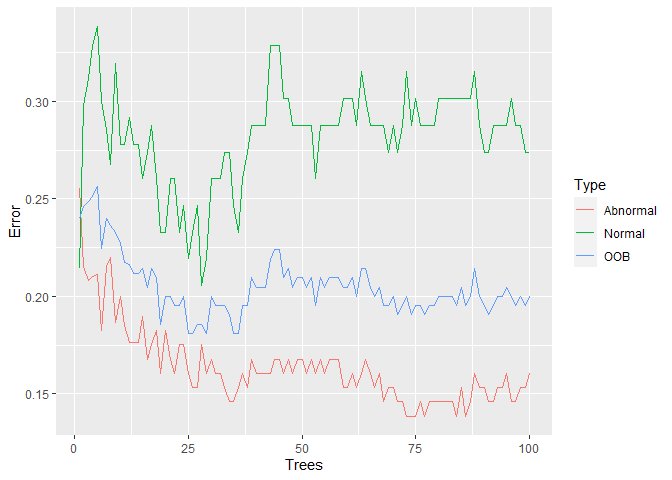

Final\_Report
================

### **목차**

-   0.분석목적
-   1.데이터소개
-   2.데이터탐색(EDA)
-   3.데이터 핸들링
-   4.모델링
-   5.결론

------------------------------------------------------------------------

### **0.분석목적**

##### 척추전방위증 환자,정상 여부를 Accuracy기준으로 Classification 하여 Best 한 성능을 갖는 모형 찾기

------------------------------------------------------------------------

### **1.데이터소개**

##### 척추전방전위증은 위 척추뼈가 아래 척추뼈보다 앞으로 밀려나가면서 배 쪽으로 튀어나와 신경을 손상시켜 허리통증과 다리 저림을 일으키는 질환입니다.

<center>

</center>

------------------------------------------------------------------------

#### 1-1) 변수(Feature) 설명

------------------------------------------------------------------------

<center>

</center>

-   pelvic incidence(PI) : 골반 경사
-   pelvic tilt(PT) : 골반 기울기
-   sacral slope(SS) : 천골경사

<center>

</center>

-   lumbar lordosis angle(LLA) : 요추전만각도, 척추 1번과 5번 사이의
    각도
-   pelvic radius : 골반과 척추반위증 사이의 반경

<center>

</center>

-   degree of spondylolisthesis : 척추전방전위증 정도
-   **class** : 척추전방전위증(Abnormal), 정상(Normal) 의 Binary Data
    (분석 Target)

#### 1-2) 데이터 불러오기

``` r
setwd('C:/Users/rlaem/Desktop/student/SNU/machine_learning/main')
data <- read.csv('column_2C_weka.csv',header=T)
head(data); dim(data)
```

    ##   pelvic_incidence pelvic_tilt.numeric lumbar_lordosis_angle sacral_slope
    ## 1         63.02782           22.552586              39.60912     40.47523
    ## 2         39.05695           10.060991              25.01538     28.99596
    ## 3         68.83202           22.218482              50.09219     46.61354
    ## 4         69.29701           24.652878              44.31124     44.64413
    ## 5         49.71286            9.652075              28.31741     40.06078
    ## 6         40.25020           13.921907              25.12495     26.32829
    ##   pelvic_radius degree_spondylolisthesis    class
    ## 1      98.67292                -0.254400 Abnormal
    ## 2     114.40543                 4.564259 Abnormal
    ## 3     105.98514                -3.530317 Abnormal
    ## 4     101.86850                11.211523 Abnormal
    ## 5     108.16872                 7.918501 Abnormal
    ## 6     130.32787                 2.230652 Abnormal

    ## [1] 310   7

#### 1-3) Data 확인

``` r
str(data)
```

    ## 'data.frame':    310 obs. of  7 variables:
    ##  $ pelvic_incidence        : num  63 39.1 68.8 69.3 49.7 ...
    ##  $ pelvic_tilt.numeric     : num  22.55 10.06 22.22 24.65 9.65 ...
    ##  $ lumbar_lordosis_angle   : num  39.6 25 50.1 44.3 28.3 ...
    ##  $ sacral_slope            : num  40.5 29 46.6 44.6 40.1 ...
    ##  $ pelvic_radius           : num  98.7 114.4 106 101.9 108.2 ...
    ##  $ degree_spondylolisthesis: num  -0.254 4.564 -3.53 11.212 7.919 ...
    ##  $ class                   : chr  "Abnormal" "Abnormal" "Abnormal" "Abnormal" ...

#### 1-4) Train과 Test set 분리

``` r
set.seed(1234)
idx <- sample(1:nrow(data),size=100,replace = FALSE)
train  <- data[-idx,];
test <- data[idx,]

train$class <- ifelse(train$class =='Abnormal',1,0)
test$class <- ifelse(test$class =='Abnormal',1,0)
```

#### 1-5) 사용 Library

``` r
library(dplyr) # 데이터 핸들링 
library(ggplot2)  # 데이터 시각화 
library(gridExtra)
library(corrplot) # 상관관계 plot
library(glmnet) # elastict net
library(e1071) #svm, Naive Bayes 
library(randomForest) #랜포  
library(gbm) # boosting계열모형 
library(GGally)
```

------------------------------------------------------------------------

### **2.데이터 탐색(EDA)**

#### 2-1) 척추전방전위증 정상 / 비정상 확인

``` r
ggplot(train,aes(x=class,fill=as.factor(class)))+geom_bar(stat = 'count')+labs(x = '정상(0),비정상(1) 비율 확인') +
  geom_label(stat='count',aes(label=..count..), size=7) 
```

<!-- -->

#### 2-2) 설명변수 Histogram 확인

``` r
s1<-ggplot(train,aes(x=pelvic_incidence ))+geom_histogram(binwidth = 5, fill='red',alpha=0.5) + theme_grey() +
  scale_x_continuous(breaks= seq(0, 150, by=10))


s2<-ggplot(train,aes(x=pelvic_tilt.numeric ))+geom_histogram(binwidth = 5, fill='red',alpha=0.5) + theme_grey() +
  scale_x_continuous(breaks= seq(0, 150, by=10))

s3<-ggplot(train,aes(x=lumbar_lordosis_angle ))+geom_histogram(binwidth = 5, fill='red',alpha=0.5) + theme_grey() +
  scale_x_continuous(breaks= seq(0, 150, by=10))

s4<-ggplot(train,aes(x=sacral_slope ))+geom_histogram(binwidth = 5, fill='red',alpha=0.5) + theme_grey() +
  scale_x_continuous(breaks= seq(0, 150, by=10))

s5<-ggplot(train,aes(x=pelvic_radius ))+geom_histogram(binwidth = 5, fill='red',alpha=0.5) + theme_grey() +
  scale_x_continuous(breaks= seq(0, 150, by=10))

s6<-ggplot(train,aes(x=degree_spondylolisthesis ))+geom_histogram(binwidth = 5, fill='red',alpha=0.5) + theme_grey() 

grid.arrange(s1,s2,s3,s4,s5,s6)
```

<!-- -->

#### 2-3) abnormal 과 normal class별 설명변수 Density 확인

``` r
s1<-ggplot(train,aes(x=pelvic_incidence,fill=class))+geom_density(alpha=0.5, aes(fill=factor(class))) + labs(title="pelvic_incidence")  + theme_grey()

s2<-ggplot(train,aes(x=pelvic_tilt.numeric,fill=class))+geom_density(alpha=0.5, aes(fill=factor(class))) + labs(title="pelvic tilt")  + theme_grey()

s3<-ggplot(train,aes(x=lumbar_lordosis_angle,fill=class))+geom_density(alpha=0.5, aes(fill=factor(class))) + labs(title="lumbar lordosis angle") + theme_grey()


s4<-ggplot(train,aes(x=sacral_slope,fill=class))+geom_density(alpha=0.5, aes(fill=factor(class))) + labs(title="sacral slope") +scale_x_continuous(breaks = scales::pretty_breaks(n = 10)) + theme_grey()

s5<-ggplot(train,aes(x=pelvic_radius,fill=class))+geom_density(alpha=0.5, aes(fill=factor(class))) + labs(title="pelvic radius") + theme_grey()

s6<-ggplot(train,aes(x=degree_spondylolisthesis,fill=class))+geom_density(alpha=0.5, aes(fill=factor(class))) + labs(title="grade of spondylolisthesis") + theme_grey()
grid.arrange(s1,s2,s3,s4,s5,s6)
```

<!-- -->

***grade of spondylolisthesis**가 Classification에 중요한 변수일 수
있음(주관적 판단)*

#### 2-4) Pair plot

``` r
ggpairs(data=train,columns = 1:6,aes(colour=as.factor(class),alpha=0.5))
```

<!-- -->

*몇몇 설명변수 사이의 **multicollinearity** 확인*

### **3.데이터 핸들링**

#### 3-1) 데이터 Matrix 변환 및 Normalization

``` r
form_x <-  formula(paste0('~',paste0(colnames(train[1:6]),collapse = '+')))

# Train 데이터 Handling 

train_x_mat <- as.matrix(train[,1:6])
train_y_mat <- train[,7]

#Train 데이터 Mean,SD 

train_mean <- sapply(train[,-which(colnames(train) ==  "class")],function(x) mean(x))
train_sd <-  sapply(train[,-which(colnames(train) ==  "class")],function(x) sd(x))

# Train 데이터 정규화 
train_x_mat <- scale(train_x_mat)

# Test Data Handling 
test_x_mat <- as.matrix(test[,1:6])


for(i in 1:6){
  
  test_x_mat[,i] <-  (test_x_mat[,i] - train_mean[i])/train_sd[i]
  
}

test_y_mat <- test[,7]
```

### **4.모델링**

#### 4-1) Logistic

``` r
form <- formula(paste0('class~',paste0(colnames(train[1:6]),collapse = '+')))

result <- list()

train 
```

    ##     pelvic_incidence pelvic_tilt.numeric lumbar_lordosis_angle sacral_slope
    ## 1           63.02782          22.5525860              39.60912     40.47523
    ## 2           39.05695          10.0609915              25.01538     28.99596
    ## 3           68.83202          22.2184820              50.09219     46.61354
    ## 5           49.71286           9.6520749              28.31741     40.06078
    ## 7           53.43293          15.8643361              37.16593     37.56859
    ## 8           45.36675          10.7556114              29.03835     34.61114
    ## 9           43.79019          13.5337531              42.69081     30.25644
    ## 12          31.23239          17.7158192              15.50000     13.51657
    ## 13          48.91555          19.9645562              40.26379     28.95100
    ## 14          53.57217          20.4608282              33.10000     33.11134
    ## 15          57.30023          24.1888846              47.00000     33.11134
    ## 16          44.31891          12.5379916              36.09876     31.78092
    ## 18          31.27601           3.1446695              32.56300     28.13134
    ## 20          41.72996          12.2540741              30.12259     29.47589
    ## 23          63.07361          24.4138027              54.00000     38.65981
    ## 24          45.54079          13.0695976              30.29832     32.47119
    ## 25          36.12568          22.7587528              29.00000     13.36693
    ## 26          54.12492          26.6504886              35.32975     27.47443
    ## 27          26.14792          10.7594536              14.00000     15.38847
    ## 28          43.58096          16.5088837              47.00000     27.07208
    ## 29          44.55101          21.9311466              26.78592     22.61986
    ## 30          66.87921          24.8919989              49.27860     41.98721
    ## 31          50.81927          15.4022125              42.52894     35.41706
    ## 32          46.39026          11.0790466              32.13655     35.31121
    ## 33          44.93667          17.4438376              27.78058     27.49284
    ## 34          38.66326          12.9864414              40.00000     25.67682
    ## 35          59.59554          31.9982445              46.56025     27.59730
    ## 37          32.09099           6.9893781              35.99820     25.10161
    ## 38          35.70346          19.4432531              20.70000     16.26020
    ## 39          55.84329          28.8474476              47.69054     26.99584
    ## 42          46.44208           8.3950359              29.03723     38.04704
    ## 43          53.85480          19.2306433              32.77906     34.62416
    ## 44          66.28539          26.3278448              47.50000     39.95755
    ## 45          56.03022          16.2979149              62.27527     39.73230
    ## 46          50.91244          23.0151693              47.00000     27.89727
    ## 47          48.33264          22.2277840              36.18199     26.10485
    ## 50          41.76773          17.8994017              20.03089     23.86833
    ## 51          55.28585          20.4401184              34.00000     34.84573
    ## 52          74.43359          41.5573314              27.70000     32.87626
    ## 53          50.20967          29.7601222              36.10401     20.44955
    ## 54          30.14994          11.9174452              34.00000     18.23249
    ## 55          41.17168          17.3212060              33.46940     23.85047
    ## 56          47.65773          13.2773849              36.67999     34.38034
    ## 59          43.20318          19.6631457              35.00000     23.54004
    ## 64          77.69058          21.3806446              64.42944     56.30993
    ## 65          76.14721          21.9361856              82.96150     54.21103
    ## 67          78.49173          22.1817978              60.00000     56.30993
    ## 68          75.64973          19.3397989              64.14868     56.30993
    ## 69          72.07628          18.9461760              51.00000     53.13010
    ## 73          84.97413          33.0211746              60.85987     51.95296
    ## 74          55.51221          20.0951567              44.00000     35.41706
    ## 75          72.22233          23.0777106              91.00000     49.14462
    ## 76          70.22145          39.8227245              68.11840     30.39873
    ## 78          58.78255           7.6670442              53.33894     51.11550
    ## 80          47.74468          12.0893507              39.00000     35.65533
    ## 81          77.10657          30.4699942              69.48063     46.63658
    ## 82          74.00554          21.1224019              57.37950     52.88314
    ## 84          81.10410          24.7941679              77.88702     56.30993
    ## 86          45.44375           9.9060718              45.00000     35.53768
    ## 87          59.78527          17.8793233              59.20646     41.90594
    ## 88          44.91415          10.2189956              44.63091     34.69515
    ## 89          56.60577          16.8002002              42.00000     39.80557
    ## 91          81.65603          28.7488693              58.23282     52.90716
    ## 92          70.95273          20.1599312              62.85911     50.79280
    ## 94          58.10193          14.8376391              79.64984     43.26430
    ## 95          94.17482          15.3807698              67.70572     78.79405
    ## 97          96.65732          19.4615812              90.21150     77.19573
    ## 99          77.65512          22.4329501              93.89278     55.22217
    ## 104         49.78212           6.4668049              53.00000     43.31532
    ## 105         77.40933          29.3965454              63.23230     48.01279
    ## 106         65.00796          27.6026076              50.94752     37.40536
    ## 107         65.01377           9.8382624              57.73584     55.17551
    ## 109         63.17299           6.3309110              63.00000     56.84208
    ## 110         68.61300          15.0822353              63.01470     53.53077
    ## 112         84.99896          29.6100977              83.35219     55.38886
    ## 113         42.02139          -6.5549483              67.90000     48.57633
    ## 114         69.75667          19.2792966              48.50000     50.47737
    ## 118         86.04128          38.7506698              47.87140     47.29061
    ## 120         60.75389          15.7538935              43.19916     45.00000
    ## 121         54.74178          12.0950721              41.00000     42.64670
    ## 124         65.66535          10.5406753              56.48914     55.12467
    ## 125         74.71723          14.3216788              32.50000     60.39555
    ## 128         80.43343          16.9984790              66.53602     63.43495
    ## 129         90.51396          28.2725013              69.81394     62.24146
    ## 132         69.78101          13.7774653              58.00000     56.00354
    ## 135         52.20469          17.2126729              78.09497     34.99202
    ## 138         83.39661          34.3109893              78.42329     49.08562
    ## 139         72.05403          24.7007372              79.87402     47.35330
    ## 140         85.09550          21.0698965              91.73479     64.02561
    ## 141         69.56349          15.4011391              74.43850     54.16235
    ## 142         89.50495          48.9036526              72.00342     40.60129
    ## 143         85.29017          18.2788896             100.74422     67.01128
    ## 144         60.62622          20.5959577              64.53526     40.03026
    ## 146         85.64379          42.6891951              78.75066     42.95459
    ## 147         85.58171          30.4570386              78.23138     55.12467
    ## 148         55.08077          -3.7599299              56.00000     58.84070
    ## 150         79.24967          23.9448247              40.79670     55.30485
    ## 151         81.11260          20.6904436              60.68701     60.42216
    ## 152         48.03062           3.9698147              58.34452     44.06081
    ## 154         57.28694          15.1493501              64.00000     42.13759
    ## 157         79.47698          26.7322675              70.65098     52.74471
    ## 159         57.03510           0.3457280              49.19800     56.68937
    ## 161         92.02631          35.3926740              77.41696     56.63363
    ## 162         67.26315           7.1946611              51.69689     60.06849
    ## 164        115.92326          37.5154360              76.80000     78.40782
    ## 165         53.94166           9.3065944              43.10050     44.63506
    ## 166         83.70318          20.2682286              77.11060     63.43495
    ## 167         56.99140           6.8740890              57.00901     50.11731
    ## 168         72.34359          16.4207896              59.86901     55.92280
    ## 171         64.80954          15.1740780              58.83999     49.63546
    ## 172         78.40125          14.0422597              79.69426     64.35899
    ## 173         56.66829          13.4582034              43.76971     43.21009
    ## 174         50.82503           9.0647290              56.30000     41.76030
    ## 176         56.56382           8.9612616              52.57785     47.60256
    ## 177         67.02766          13.2815022              66.15040     53.74616
    ## 178         80.81777          19.2389807              61.64245     61.57879
    ## 180         68.72191          49.4318636              68.05601     19.29005
    ## 183         75.43775          31.5394540              89.60000     43.89829
    ## 185         81.05661          20.8014922              91.78450     60.25512
    ## 187         81.08232          21.2558403              78.76676     59.82648
    ## 188         60.41993           5.2656654              59.81424     55.15427
    ## 189         85.68095          38.6500353              82.68098     47.03091
    ## 190         82.40652          29.2764219              77.05456     53.13010
    ## 192         86.47290          40.3037657              61.14101     46.16914
    ## 196         71.24176           5.2682705              85.99958     65.97349
    ## 197         63.77239          12.7633848              65.36052     51.00901
    ## 198         58.82838          37.5778732             125.74239     21.25051
    ## 199         74.85448          13.9090842              62.69326     60.94540
    ## 200         75.29848          16.6714836              61.29620     58.62699
    ## 201         63.36434          20.0246213              67.49871     43.33972
    ## 202         67.51305          33.2755899              96.28306     34.23746
    ## 203         76.31403          41.9336829              93.28486     34.38034
    ## 205         56.53505          14.3771893              44.99155     42.15786
    ## 206         80.11157          33.9424322              85.10161     46.16914
    ## 207         95.48023          46.5500532              59.00000     48.93018
    ## 209         87.67909          20.3656133              93.82242     67.31347
    ## 210         48.25992          16.4174624              36.32914     31.84246
    ## 211         38.50527          16.9642969              35.11281     21.54098
    ## 213         44.36249           8.9454349              46.90210     35.41706
    ## 216         30.74194          13.3549659              35.90353     17.38697
    ## 217         50.91310           6.6769999              30.89652     44.23610
    ## 219         51.62467          15.9693437              35.00000     35.65533
    ## 220         64.31187          26.3283690              50.95896     37.98350
    ## 222         54.95097           5.8653534              53.00000     49.08562
    ## 223         56.10377          13.1063067              62.63702     42.99747
    ## 225         89.83468          22.6392168              90.56346     67.19546
    ## 226         59.72614           7.7248726              55.34349     52.00127
    ## 227         63.95952          16.0609449              63.12374     47.89858
    ## 230         43.43645          10.0957433              36.03222     33.34071
    ## 231         65.61180          23.1379192              62.58218     42.47388
    ## 232         53.91105          12.9393180              39.00000     40.97174
    ## 233         43.11795          13.8157436              40.34739     29.30221
    ## 235         37.73199           9.3862983              42.00000     28.34569
    ## 236         63.92947          19.9710967              40.17705     43.95837
    ## 238         62.14081          13.9609752              58.00000     48.17983
    ## 239         69.00491          13.2917897              55.57014     55.71312
    ## 240         56.44703          19.4444991              43.57785     37.00253
    ## 241         41.64692           8.8355491              36.03197     32.81137
    ## 242         51.52936          13.5178473              35.00000     38.01151
    ## 243         39.08726           5.5366025              26.93204     33.55066
    ## 246         47.80556          10.6886982              54.00000     37.11686
    ## 247         46.63786          15.8537171              40.00000     30.78415
    ## 249         47.31965           8.5736803              35.56025     38.74597
    ## 250         50.75329          20.2350596              37.00000     30.51823
    ## 251         36.15783          -0.8105141              33.62731     36.96834
    ## 252         40.74700           1.8355243              50.00000     38.91147
    ## 253         42.91804          -5.8459943              58.00000     48.76403
    ## 254         63.79243          21.3453234              66.00000     42.44710
    ## 255         72.95564          19.5769715              61.00707     53.37867
    ## 256         67.53818          14.6550422              58.00143     52.88314
    ## 257         54.75252           9.7525196              48.00000     45.00000
    ## 259         40.34930          10.1947485              37.96775     30.15455
    ## 260         63.61919          16.9345078              49.34926     46.68468
    ## 261         54.14241          11.9351101              43.00000     42.20730
    ## 262         74.97602          14.9217049              53.73007     60.05432
    ## 263         42.51727          14.3756713              25.32357     28.14160
    ## 266         48.17075           9.5942167              39.71092     38.57653
    ## 267         46.37409          10.2159024              42.70000     36.15819
    ## 272         42.51561          16.5412162              42.00000     25.97439
    ## 273         39.35871           7.0112618              37.00000     32.34744
    ## 274         35.87757           1.1123736              43.45726     34.76520
    ## 276         67.28971          16.7175142              51.00000     50.57220
    ## 277         51.32546          13.6312232              33.25858     37.69424
    ## 278         65.75635          13.2069264              44.00000     52.54942
    ## 279         40.41337          -1.3294124              30.98277     41.74278
    ## 280         48.80191          18.0177620              52.00000     30.78415
    ## 281         50.08615          13.4300442              34.45754     36.65611
    ## 282         64.26151          14.4978655              43.90250     49.76364
    ## 283         53.68338          13.4470217              41.58430     40.23636
    ## 286         67.80469          16.5506617              43.25680     51.25403
    ## 287         61.73488          17.1143120              46.90000     44.62056
    ## 289         74.56502          15.7243199              58.61858     58.84070
    ## 290         44.43070          14.1742639              32.24350     30.25644
    ## 291         36.42249          13.8794245              20.24256     22.54306
    ## 292         51.07983          14.2099353              35.95123     36.86990
    ## 293         34.75674           2.6317396              29.50438     32.12500
    ## 294         48.90290           5.5875887              55.50000     43.31532
    ## 295         46.23640          10.0627701              37.00000     36.17363
    ## 296         46.42637           6.6207950              48.10000     39.80557
    ## 297         39.65690          16.2088394              36.67486     23.44806
    ## 298         45.57548          18.7591354              33.77414     26.81635
    ## 299         66.50718          20.8976721              31.72747     45.60951
    ## 301         50.67668           6.4615013              35.00000     44.21518
    ## 303         54.60032          21.4889743              29.36022     33.11134
    ## 305         45.07545          12.3069512              44.58318     32.76850
    ## 306         47.90357          13.6166882              36.00000     34.28688
    ## 307         53.93675          20.7214963              29.22053     33.21525
    ## 308         61.44660          22.6949683              46.17035     38.75163
    ## 309         45.25279           8.6931574              41.58313     36.55963
    ## 310         33.84164           5.0739914              36.64123     28.76765
    ##     pelvic_radius degree_spondylolisthesis class
    ## 1        98.67292               -0.2544000     1
    ## 2       114.40543                4.5642586     1
    ## 3       105.98514               -3.5303173     1
    ## 5       108.16872                7.9185006     1
    ## 7       120.56752                5.9885507     1
    ## 8       117.27007              -10.6758708     1
    ## 9       125.00289               13.2890182     1
    ## 12      120.05540                0.4997514     1
    ## 13      119.32136                8.0288946     1
    ## 14      110.96670                7.0448029     1
    ## 15      116.80659                5.7669469     1
    ## 16      124.11584                5.4158251     1
    ## 18      129.01142                3.6230201     1
    ## 20      116.58571               -1.2444025     1
    ## 23      106.42433               15.7796968     1
    ## 24      117.98083               -4.9871296     1
    ## 25      115.57712               -3.2375625     1
    ## 26      121.44701                1.5712048     1
    ## 27      125.20330              -10.0931082     1
    ## 28      109.27163                8.9928157     1
    ## 29      111.07292                2.6523206     1
    ## 30      113.47702               -2.0058917     1
    ## 31      112.19280               10.8695655     1
    ## 32       98.77455                6.3868316     1
    ## 33      117.98032                5.5696196     1
    ## 34      124.91412                2.7030081     1
    ## 35      119.33035                1.4742858     1
    ## 37      132.26474                6.4134277     1
    ## 38      137.54061               -0.2634897     1
    ## 39      123.31184                2.8124269     1
    ## 42      115.48140                2.0454758     1
    ## 43      121.67091                5.3298432     1
    ## 44      121.21968               -0.7996245     1
    ## 45      114.02312               -2.3256838     1
    ## 46      117.42226               -2.5267015     1
    ## 47      117.38463                6.4817091     1
    ## 50      118.36339                2.0629625     1
    ## 51      115.87702                3.5583724     1
    ## 52      107.94930                5.0000888     1
    ## 53      128.29251                5.7406141     1
    ## 54      112.68414               11.4632233     1
    ## 55      116.37789               -9.5692499     1
    ## 56       98.24978                6.2730122     1
    ## 59      124.84611               -2.9190760     1
    ## 64      114.81875               26.9318410     1
    ## 65      123.93201               10.4319719     1
    ## 67      118.53033               27.3832131     1
    ## 68       95.90363               69.5513029     1
    ## 69      114.21301                1.0100405     1
    ## 73      125.65953               74.3334086     1
    ## 74      122.64875               34.5529464     1
    ## 75      137.73665               56.8040928     1
    ## 76      148.52556              145.3781432     1
    ## 78       98.50116               51.5841248     1
    ## 80      117.51200               21.6824014     1
    ## 81      112.15160               70.7590831     1
    ## 82      120.20596               74.5551659     1
    ## 84      151.83986               65.2146161     1
    ## 86      163.07104               20.3153153     1
    ## 87      119.31911               22.1238687     1
    ## 88      130.07566               37.3645399     1
    ## 89      127.29452               24.0185747     1
    ## 91      114.76986               30.6091484     1
    ## 92      116.17793               32.5223310     1
    ## 94      113.58766               50.2378781     1
    ## 95      114.89011               53.2552200     1
    ## 97      120.67304               64.0809984     1
    ## 99      123.05571               61.2111866     1
    ## 104     110.86478               25.3356473     1
    ## 105     118.45073               93.5637373     1
    ## 106     116.58111                7.0159779     1
    ## 107      94.73853               49.6969546     1
    ## 109     110.64402               42.6080757     1
    ## 110     123.43117               39.4979866     1
    ## 112     126.91299               71.3211754     1
    ## 113     111.58578               27.3386709     1
    ## 114      96.49137               51.1696403     1
    ## 118     122.09295               61.9882771     1
    ## 120     113.05333               31.6935484     1
    ## 121     117.64322               40.3823266     1
    ## 124     109.16278               53.9320201     1
    ## 125     107.18222               37.0170801     1
    ## 128     116.43898               57.7812500     1
    ## 129     100.89216               58.8236482     1
    ## 132     118.93067               17.9145605     1
    ## 135     136.97252               54.9391342     1
    ## 138     110.46652               49.6720956     1
    ## 139     107.17236               56.4261587     1
    ## 140     109.06231               38.0328311     1
    ## 141     105.06736               29.7012108     1
    ## 142     134.63429              118.3533701     1
    ## 143     110.66070               58.8849480     1
    ## 144     117.22555              104.8592474     1
    ## 146     105.14408               42.8874258     1
    ## 147     114.86605               68.3761218     1
    ## 148     109.91537               31.7735832     1
    ## 150      98.62251               36.7063954     1
    ## 151      94.01878               40.5109823     1
    ## 152     125.35096               35.0000778     1
    ## 154     116.73539               30.3412033     1
    ## 157     118.58867               61.7005982     1
    ## 159     103.04870               52.1651450     1
    ## 161     115.72353               58.0575416     1
    ## 162      97.80109               42.1369433     1
    ## 164     104.69860               81.1989271     1
    ## 165     124.39782               25.0821266     1
    ## 166     125.48017               69.2795710     1
    ## 167     109.97804               36.8101106     1
    ## 168      70.08257               12.0726443     1
    ## 171     111.67996               21.4071984     1
    ## 172     104.73123               12.3928533     1
    ## 173      93.69221               21.1081214     1
    ## 174      78.99945               23.0415243     1
    ## 176      98.77712               50.7018733     1
    ## 177     100.71541               33.9891355     1
    ## 178      89.47183               44.1676020     1
    ## 180     125.01852               54.6912893     1
    ## 183     106.82959               54.9657890     1
    ## 185     125.43018               38.1817818     1
    ## 187      90.07188               49.1594260     1
    ## 188     109.03307               30.2657853     1
    ## 189     120.84071               61.9590343     1
    ## 190     117.04224               62.7653483     1
    ## 192      97.40419               55.7522215     1
    ## 196     110.70311               38.2598637     1
    ## 197      89.82274               55.9954539     1
    ## 198     135.62942              117.3146829     1
    ## 199     115.20870               33.1722551     1
    ## 200     118.88339               31.5758229     1
    ## 201     130.99926               37.5567055     1
    ## 202     145.60103               88.3014859     1
    ## 203     132.26729              101.2187828     1
    ## 205     101.72333               25.7731736     1
    ## 206     125.59362              100.2921068     1
    ## 207      96.68390               77.2830719     1
    ## 209     120.94483               76.7306290     1
    ## 210      94.88234               28.3437991     1
    ## 211     127.63287                7.9866832     0
    ## 213     129.22068                4.9941953     0
    ## 216     142.41011               -2.0053729     0
    ## 217     118.15153               -1.0579855     0
    ## 219     129.38531                1.0092283     0
    ## 220     106.17775                3.1182213     0
    ## 222     126.97033               -0.6316030     0
    ## 223     116.22850               31.1727673     0
    ## 225     100.50119                3.0409733     0
    ## 226     125.17422                3.2351592     0
    ## 227     142.36012                6.2989709     0
    ## 230     137.43969               -3.1144509     0
    ## 231     124.12800               -4.0832984     0
    ## 232     118.19304                5.0743532     0
    ## 233     128.51772                0.9709264     0
    ## 235     135.74093               13.6830467     0
    ## 236     113.06594              -11.0581787     0
    ## 238     133.28183                4.9551057     0
    ## 239     126.61162               10.8320111     0
    ## 240     139.18969               -1.8596885     0
    ## 241     116.55517               -6.0545380     0
    ## 242     126.71852               13.9283309     0
    ## 243     131.58442               -0.7594614     0
    ## 246     125.39114               -0.4025232     0
    ## 247     119.37760                9.0645817     0
    ## 249     120.57697                1.6306635     0
    ## 250     122.34352                2.2884877     0
    ## 251     135.93691               -2.0925065     0
    ## 252     139.24715                0.6685568     0
    ## 253     121.60686               -3.3620447     0
    ## 254     119.55039               12.3826037     0
    ## 255     111.23405                0.8134912     0
    ## 256     123.63226               25.9702063     0
    ## 257     123.03800                8.2352941     0
    ## 259     128.00993                0.4589014     0
    ## 260     117.08975               -0.3578120     0
    ## 261     122.20908                0.1535492     0
    ## 262     105.64540                1.5947477     0
    ## 263     128.90569                0.7570201     0
    ## 266     135.62331                5.3600506     0
    ## 267     121.24766               -0.5420220     0
    ## 272     120.63194                7.8767307     0
    ## 273     117.81876                1.9040482     0
    ## 274     126.92391               -1.6322383     0
    ## 276     137.59178                4.9603438     0
    ## 277     131.30612                1.7888697     0
    ## 278     129.39357               -1.9821200     0
    ## 279     119.33565               -6.1736748     0
    ## 280     139.15041               10.4428617     0
    ## 281     119.13462                3.0894845     0
    ## 282     115.38827                5.9514544     0
    ## 283     113.91370                2.7370353     0
    ## 286     119.68565                4.8675399     0
    ## 287     120.92020                3.0877260     0
    ## 289     105.41730                0.5992471     0
    ## 290     131.71761               -3.6042553     0
    ## 291     126.07686                0.1797171     0
    ## 292     115.80371                6.9050900     0
    ## 293     127.13985               -0.4608942     0
    ## 294     137.10829               19.8547592     0
    ## 295     128.06362               -5.1000533     0
    ## 296     130.35010                2.4493824     0
    ## 297     131.92201               -4.9689799     0
    ## 298     116.79701                3.1319099     0
    ## 299     128.90290                1.5172034     0
    ## 301     116.58797               -0.2147106     0
    ## 303     118.34332               -1.4710673     0
    ## 305     147.89464               -8.9417094     0
    ## 306     117.44906               -4.2453954     0
    ## 307     114.36584               -0.4210104     0
    ## 308     125.67072               -2.7078795     0
    ## 309     118.54584                0.2147502     0
    ## 310     123.94524               -0.1992491     0

``` r
logit <- glm(form,data=train,family=binomial(link = "logit"))
logit_s <- glm(form,data=data.frame(train_x_mat,class=train_y_mat),binomial(link = "logit"))
```

#### 4-1) Logistic Threshold 찾기

``` r
result <- list()
logit_trshld1 <- c()


for(i in 1:99){
  TN <- table(ifelse(predict(logit,newdata=train,type='response') >= i/100,1,0),train$class)[1,1]
  TP <- table(ifelse(predict(logit,newdata=train,type='response') >= i/100,1,0),train$class)[2,2]
  logit_trshld1[i] <- (TP+TN)/dim(train)[1]
  }


t <- which.max(logit_trshld1)

result[['logit']] <- (table(ifelse(predict(logit,newdata=test,type='response') >= t/100,1,0),test$class)[1,1] +
                     table(ifelse(predict(logit,newdata=test,type='response') >= t/100,1,0),test$class)[2,2])/dim(test)[1]
```

#### 4-2) Ridge Regression

``` r
set.seed(1234)

ridge <- cv.glmnet(train_x_mat,train_y_mat,family='binomial',type.measure = 'auc',alpha=0) # Ridge 
ridge_lambda <- ridge$lambda.min

plot(ridge)
```

<!-- -->

``` r
result[['ridge']] <- sum(diag(table(predict(ridge,newx=test_x_mat,s=ridge_lambda,type='class'),test_y_mat))/dim(test)[1])
```

#### 4-3) LASSO

``` r
lasso <- cv.glmnet(train_x_mat,train_y_mat,,family='binomial',type.measure = 'auc',alpha=1) 
lasso_lambda <- lasso$lambda.min

plot(lasso)
```

<!-- -->

``` r
result[['lasso']] <- sum(diag(table(predict(lasso,newx=test_x_mat,s=lasso_lambda,type='class'),test_y_mat))/dim(test)[1])
```

#### 4-4) Random Forest

``` r
set.seed(1234)
rf <- list()

# Simple Tunning 

grid <- expand.grid(ntree=c(100, 500, 1000,2500), mtry=c(3,4,5)) # 12가지로 나눠서 튜닝 
temp <- c()

for(i in 1:nrow(grid)){
  
  rf[[i]] <- randomForest(form,data=data.frame(train[,1:6],class=as.factor(train_y_mat))
                          ,ntree=grid[i,1]
                          ,mtry=grid[i,2]
                          ,importance=TRUE)
  
  temp[i] <- sum(diag(rf[[i]]$confusion))/dim(train)[1]
}
```

#### 4-4) OOB with Best Tunning (랜덤포레스트)

``` r
grid[9,] # ntree = 100 , mtry =5 
```

    ##   ntree mtry
    ## 9   100    5

``` r
rf <- randomForest(form,data=data.frame(train[,1:6],class=factor(train$class)),ntree=100,mtry=5,importance=TRUE)

oob <- data.frame(Trees = rep(1:nrow(rf$err.rate), 3), 
                  Type = rep(c("OOB","Normal","Abnormal"), each = nrow(rf$err.rate)),
                  Error = c(rf$err.rate[,1], rf$err.rate[,2], rf$err.rate[,3]))

ggplot(data = oob, aes(x = Trees, y= Error)) + geom_line(aes(colour = Type))
```

<!-- -->

``` r
result[['rf']] <- sum(diag(table(predict(rf,newdata=test),test_y_mat)))/dim(test)[1]
```

#### 4-5) Gradient Boosting Model

``` r
grid <- expand.grid(ntrees= c(100,200,500,1000),inter = c(1,2,3,4),learn = c(0.01,0.05,0.1))

gb <- list() 

# 
# for(i in 1:nrow(grid)){
# 
# 
# gb[[i]] <- gbm(form
#     , data=train
#     , distribution = "bernoulli"
#     , cv.folds = 10
#     , n.trees = grid[i,1]
#     , interaction.depth = grid[i,2]
#     , shrinkage = grid[i,3])
# 
# }


  
# Best 튜닝 

# gb_result <- c() 
# 
# for(i in 1:48){
#   gb_result[i] <- sum(diag(table(ifelse(predict(gb[[i]],newdat=train,type = 'response') >= 0.5,1,0),train_y_mat)))/dim(train)[1]
#   
# }


# Best 튜닝 (ntrees =500, interaction =4 , learn = 0.05) 95.7% 정확도 


gb <- gbm(form
    , data=train
    , distribution = "bernoulli"
    , cv.folds = 10
    , n.trees = 500
    , interaction.depth = 4
    , shrinkage = 0.05)


result[['gbm']] <- sum(diag(table(ifelse(predict(gb,newdat=test,type = 'response') >= 0.5,1,0),test_y_mat)))/dim(test)[1]
```

    ## Using 61 trees...

#### Support Vector Machine

``` r
set.seed(1234)
tune_svm <- tune(svm, form,train.x = train,train.y = train_y_mat,kernel="radial"
                 ,ranges = list(cost=10^(-2:3),gamma=c(0.5,1,2,3,4))
                 )
tune_svm 
```

    ## 
    ## Parameter tuning of 'svm':
    ## 
    ## - sampling method: 10-fold cross validation 
    ## 
    ## - best parameters:
    ##  cost gamma
    ##     1   0.5
    ## 
    ## - best performance: 0.0157214

``` r
# cost 1 ,gamma 0.5 (best tunning)

svm_fit <-svm(form,data=train,kernel="radial",cost=1,gamma=0.5)

result[['svm']] <- sum(diag(table(ifelse(predict(svm_fit,newdata=test,type='response')>=0.5,1,0),test_y_mat)))/dim(test)[1]
```

### **5.결론**

``` r
final <- as.data.frame(do.call(rbind,result))

final <- data.frame(model = rownames(final), AUC = final$V1)

ggplot(final,aes(model,AUC,fill=model))+geom_bar(stat='identity')+geom_label(aes(label=AUC)) 
```

<!-- -->
\#\#\#\# **결론 : 데이터 사이즈가 작다보니, Logistic 모형이 다른
머신러닝 방법과 성능에서 큰 차이를 보이지 않는다.** \#\#\#\#
**로지스틱의 경우 Accuracy가 0.88, SVM이 0.88로 같은 성능을 보이고
있다.** \#\#\#\# **향후 다른 성능을 평가기준(Metric) 으로 모형을
적합하거나 seed를 바꿔가면서 각 모형 성능 비교가 필요하다**
